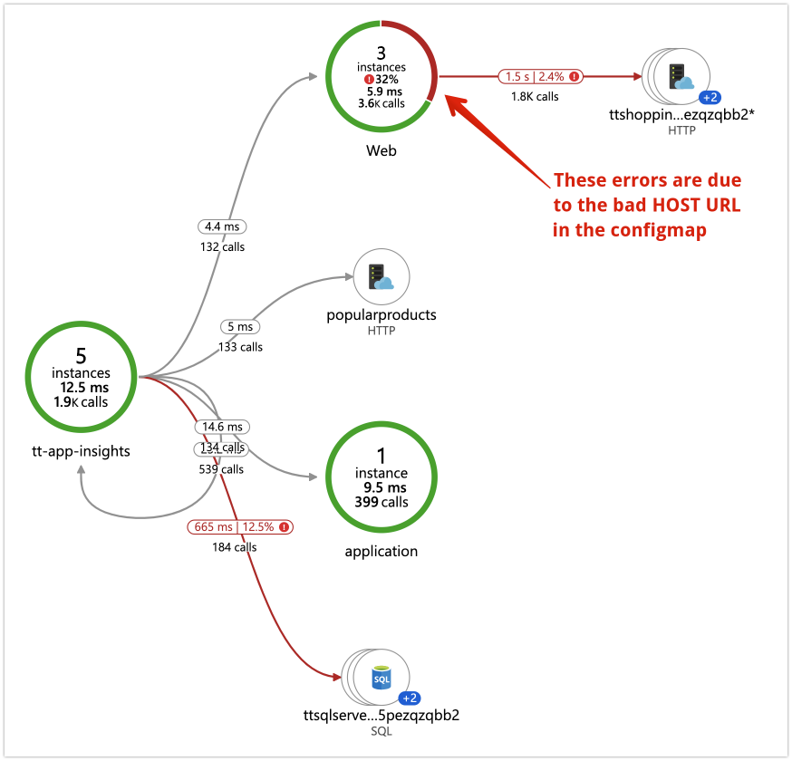

# Demo 3: Remediation of Shopping Cart

| [README](/ops20/README.md) | [Slides](/ops20/slides/README.md) | [Demos](/ops20/demos/README.md) | [Deployment](/ops20/deployment/README.md) |
|--------|-------|------------|-----------|

>**Do you need to show videos instead of doing the demo live?:** Below, you'll find "stage-ready" videos that may be used in the event this presentation should be delivered offline. As of 10/18 all links below point to the full recording of demo 3. This will be broken down further soon.

|  | Video | Description
|--------|-------|-----|
| [Part 1: Azure Dashboard](#part-1-azure-dashboard) | [Link](https://https://globaleventcdn.blob.core.windows.net/assets/ops/ops20/video/demo_3_full.mp4) | Demonstrate the Azure Dashboard
| [Part 2: Azure Service Health](#part-2-azure-service-health) | [Link](https://https://globaleventcdn.blob.core.windows.net/assets/ops/ops20/video/demo_3_full.mp4) | Demonstrate Azure Service Health
| [Part 3: Log Analytics](#part-5-log-analytics) | [Link](https://https://globaleventcdn.blob.core.windows.net/assets/ops/ops20/video/demo_3_full.mp4) | Demonstrate Log Analytics
| [Part 4: KQL (Kusto Query Language)](#part-6-kql-kusto-query-language) | [Link](https://https://globaleventcdn.blob.core.windows.net/assets/ops/ops20/video/demo_3_full.mp4) | Demonstrate KQL - Kusto Query Language
| [Part 5: Application Map](#part-3-application-map) | [Link](https://https://globaleventcdn.blob.core.windows.net/assets/ops/ops20/video/demo_3_full.mp4) | Demonstrate Application Map

**Question:** *What are we trying to demonstrate?*

**Answer:** We are demonstrating several tools within the Azure ecosystem that can help reduce the time to recover from a service disruption.

This demo touches on seven (5) unique products within the Azure ecosystem we will use to "respond" & "remediate" an active "incident".

We will navigate through a number of tools beginning with the Application Dashboard. [Look here for instructions on how to create the dashboard](../../deployment/dashboard/README.md) prior to the demo.

>**Presenter Setup Checklist:**

- [ ] Dashboard created open in own tab.    


## Part 1: Azure Dashboard

>**Presenter Note:** The Dashboard is not created automatically during the deployment. To create the dashboard used in this demonstration, simply press the "Application Dashboard" button found in Application Insights. Be sure to have created this before you begin the presentation. [Full instructions are found here](/deployment/dashboard/README.md)

From the Dashboard, we will explore the following tools: Azure Service Health (**note:** a block needs to be added to the dashboard)

## Part 2: Azure Service Health

## Part 3: Application Map

From the Azure Application Map we should be able to see problems occuring in the connection between the front end of the system and the database.



## Part 5: Log Analytics

Demonstrate the multiple tables and features of Log Analytics such as the ability to use predefined queries, and save your own.

## Part 6: KQL (Kusto Query Language)

Demonstrate querying any part of the system by manually typing in the following query because we *"want to see all log entries that contain something about the cart"*.

``` KQL
ContainerLog | where LogEntry contains "cart"
```

End of demonstration.
