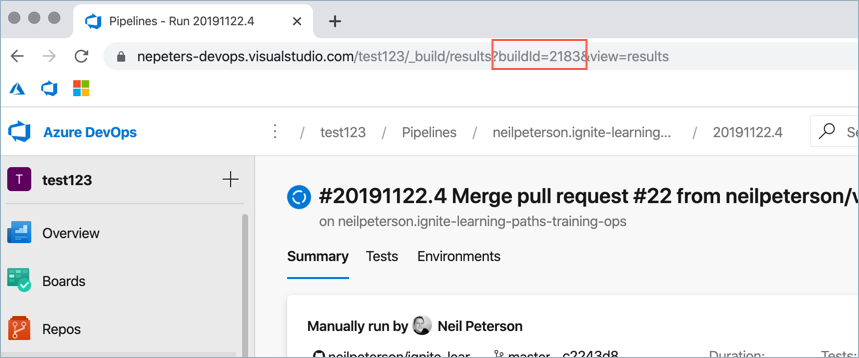

# OPS40 Demo Guide

## Demo 1 - Tailwind Traders

If you have elected to break the Tailwind Traders app, you can demo the break here. To get the address of the application run the following command.

```
$ k get ingress
NAME HOSTS ADDRESS PORTS AGE
my-tt-cart d4aa3f5a552742c8be0f.eastus.aksapp.io 40.71.39.243 80 30h
```

Browse to the `HOSTS` address and click on the tailwind cart icon.

## Demo 1 - Pipeline overview (stages, jobs, concurrency, tasks)

- Create a pull request
- Show that a new instance of the pipeline has started 
- Variables
- Stage conditions, dependencies, and concurrency
- Jobs and concurrency
- Tasks

## Demo 2 - Tests

- Show tests in VSCode
- Show tests results and logging
- Show dashboarding
- Show test results in GitHub
- Merge pull request

## Demo 3 - Deployment Jobs and Environments

- Deployment Job
- Environment logging
- Environment checks

## Demo 4 - Production Reconciliation

- Build ID Variable in YAML
- Show ACR container image
- Show running container in Kubernetes

## Demo 5 - Production Reconciliation

At this point, hopefully, the pre-production deployment has completed. Show how production can be reconciled .via build ID (helm release version and container image version).

1. Get the latest build id, this can be seen in the last runs URL.



2. Navigate back to the pipeline YAML and show how the built-in `Build.BuildId` variable can be used as a task value.

```
- task: HelmDeploy@0
 displayName: 'helm package (tt-cart)'
 inputs:
 command: package
 chartPath: 'Deploy/helm/cart-api'
 arguments: '--version $(Build.BuildId)'
```

3. Return a list of helm release, and show that the chart used to release the `CHART` has a version that matches the build-id.

```
$ helm list

NAME REVISION UPDATED STATUS CHART NAMESPACE
my-tt-cart 3 Mon Oct 14 13:14:25 2019 DEPLOYED cart-api-1 default
```

4. Return a list of pods to get the name of the cart pod.

```
$ kubectl get pods

my-tt-cart-cart-api-77db6f9f58-wqs7p 1/1 Running 0 11h
my-tt-coupon-tt-coupons-85c96964fc-z7tc7 1/1 Running 0 15h
my-tt-image-classifier-7d6d97875f-4z66s 1/1 Running 0 15h
my-tt-login-7f88cff49-fqk95 1/1 Running 0 15h
my-tt-mobilebff-67dcb9f988-7vgc9 1/1 Running 0 15h
my-tt-popular-product-tt-popularproducts-67dfcc8b67-f7knj 1/1 Running 0 15h
my-tt-product-tt-products-d9c54d955-6fmd8 1/1 Running 0 15h
my-tt-profile-5c57bf89b4-5z79c 1/1 Running 0 15h
my-tt-stock-6b969dd459-hw559 1/1 Running 0 15h
my-tt-webbff-67849c78b7-qhvlg 1/1 Running 0 15h
web-6b56cc7d7c-w7t9x 1/1 Running 0 15h
```

5. Describe the cart pod to see the Docker image used to start it. Note that the image version matches the Build ID.

```
$ kubectl describe pod my-tt-cart-cart-api-77db6f9f58-wqs7p

Containers:
 cart-api:
 Container ID: docker://9438c601b838855659abef2f68ab19c281bd172525ce09aedbbcf65dc0940580
 Image: ttacr5iny4v2wygm3k.azurecr.io/cart.api:1818
```